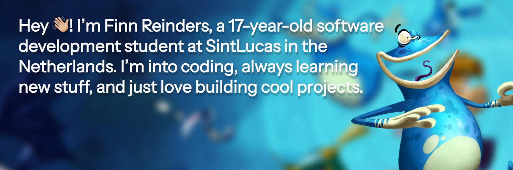

  

###

<h2 align="left">📃 Here's a list of languages I'm currently exploring and learning:</h3>

###

  
  
  
  
  
  
  

###

<h2>👨🏼‍💻 About Me:</h2>   

<h2>❤️ You can contact me via:</h2>

  
  
  

###

  

###